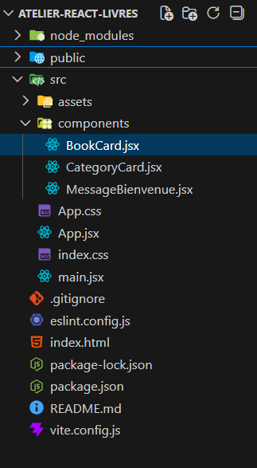
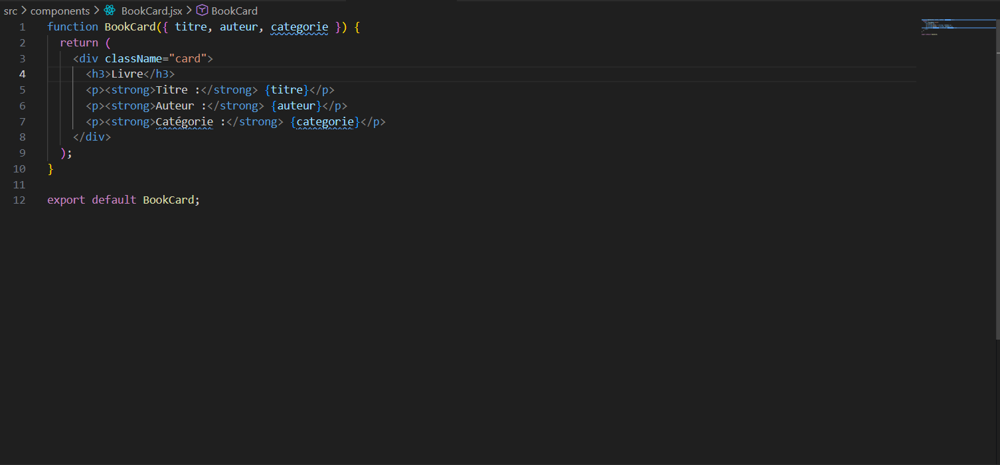
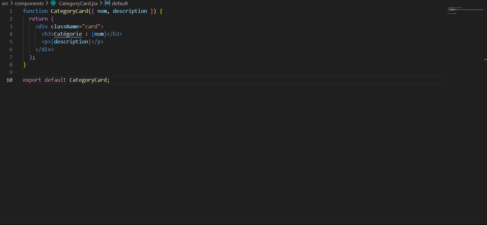
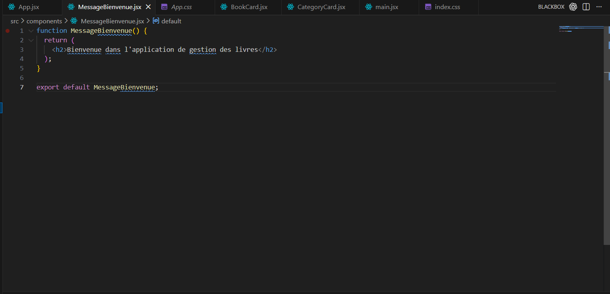
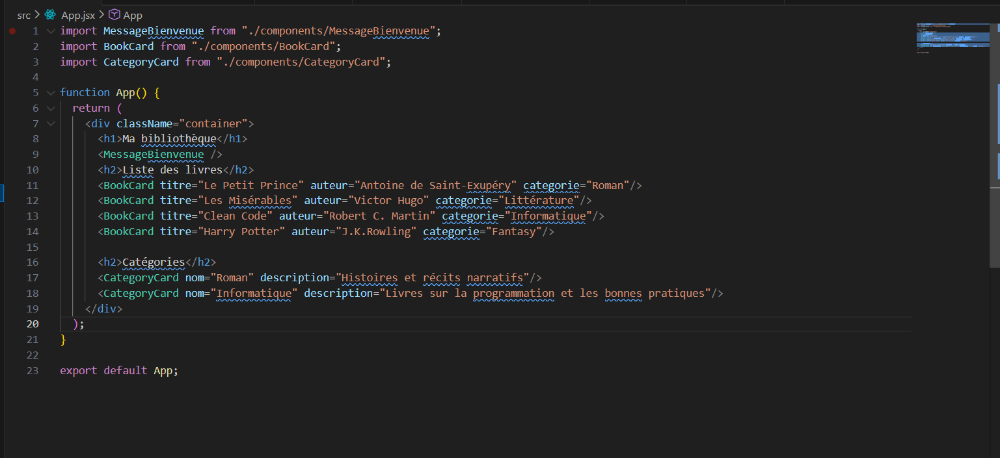
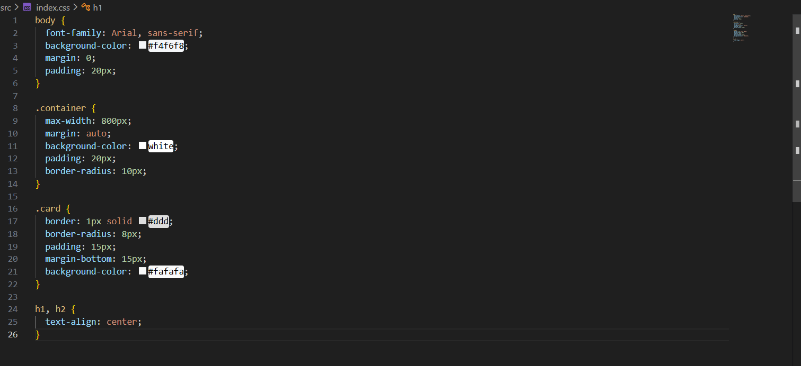
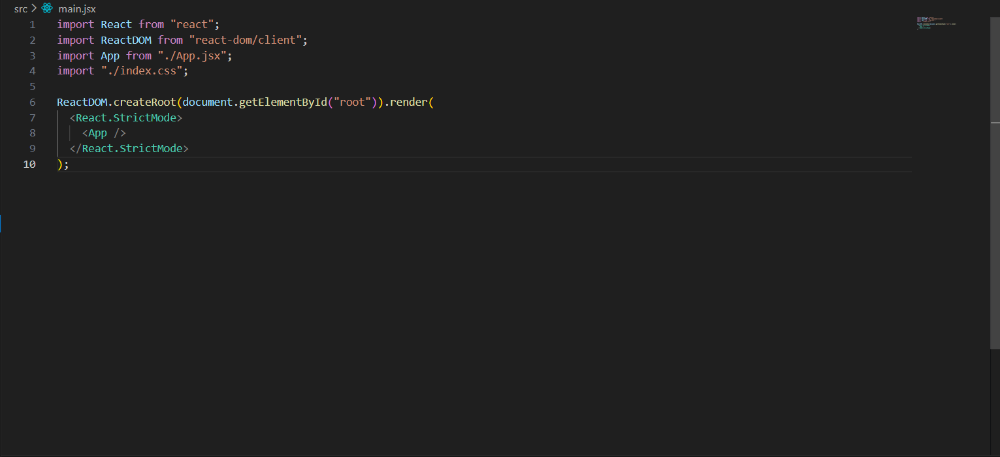
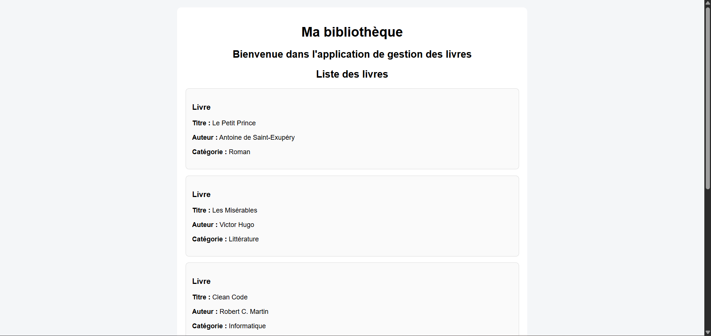
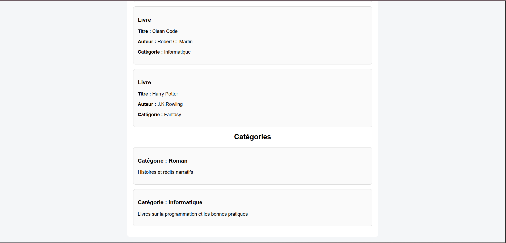

# Compte Rendu Complet - Atelier React Livres

Mise a jour: 4 mars 2026

## 1. Resume du projet
Ce projet est une application React realisee dans le cadre d'un TP de Developpement Web Avance.
Le sujet consiste a construire une interface de gestion de livres en appliquant les fondamentaux React:
- decomposition en composants
- passage de donnees avec les props
- reutilisation des composants
- structuration propre du projet

Le rendu final affiche:
- un message de bienvenue
- une liste de livres
- une section categories

## 2. Objectifs pedagogiques atteints
- creer une application React avec Vite
- organiser le code en composants autonomes
- separer la logique d'assemblage (`App.jsx`) et la presentation (`components/`)
- appliquer un style global simple et coherent

## 3. Stack technique
- React `19.2.0`
- React DOM `19.2.0`
- Vite `7.3.1`
- ESLint `9.39.1`

## 4. Architecture fonctionnelle

### 4.1 Vue d'ensemble
L'architecture est basee sur un composant parent `App` qui orchestre trois composants enfants:
- `MessageBienvenue` pour l'entete fonctionnelle
- `BookCard` pour afficher chaque livre
- `CategoryCard` pour afficher chaque categorie

### 4.2 Roles des composants

| Fichier | Role principal | Entree (props) | Sortie |
|---|---|---|---|
| `src/main.jsx` | Point d'entree React | Aucune | Monte l'application dans `#root` |
| `src/App.jsx` | Composition de la page | Aucune | Assemble les sections et injecte les donnees |
| `src/components/MessageBienvenue.jsx` | Message d'accueil | Aucune | Un titre de bienvenue |
| `src/components/BookCard.jsx` | Carte livre reutilisable | `titre`, `auteur`, `categorie` | Bloc visuel de livre |
| `src/components/CategoryCard.jsx` | Carte categorie reutilisable | `nom`, `description` | Bloc visuel de categorie |

### 4.3 Flux de donnees
Le flux suit une strategie descendante (one-way data flow):
1. `App.jsx` contient les donnees statiques.
2. `App.jsx` passe ces valeurs aux composants enfants via props.
3. Les composants enfants affichent les informations sans modifier l'etat global.

Ce choix est adapte a une application d'initiation, facile a lire et a maintenir.

## 5. Architecture des styles
- `src/index.css` centralise le style global:
  - fond de page
  - conteneur principal
  - style uniforme des cartes
  - alignement des titres
- `src/App.css` est un fichier de style issu du template Vite, non critique pour le rendu actuel.

## 6. Structure du projet
```text
atelier-react-livres/
|-- public/
|-- screens/
|   |-- 1.png
|   |-- 2.png
|   |-- 3.png
|   |-- 4.png
|   |-- 5.png
|   |-- 6.png
|   |-- 7.png
|   |-- affichage1.png
|   `-- affichage2.png
|-- src/
|   |-- components/
|   |   |-- BookCard.jsx
|   |   |-- CategoryCard.jsx
|   |   `-- MessageBienvenue.jsx
|   |-- App.css
|   |-- App.jsx
|   |-- index.css
|   `-- main.jsx
|-- package.json
`-- README.md
```

## 7. Execution du projet

### 7.1 Prerequis
- Node.js 18 ou plus
- npm

### 7.2 Lancement en developpement
```bash
npm install
npm run dev
```

### 7.3 Build et previsualisation
```bash
npm run build
npm run preview
```

## 8. Evaluation technique (compte rendu)

### 8.1 Qualite de conception
- composants bien separes par responsabilite
- interface lisible et coherente
- code simple a comprendre pour un premier niveau React

### 8.2 Maintenabilite
- ajout d'un nouveau livre facile via une nouvelle instance de `BookCard`
- ajout d'une nouvelle categorie facile via `CategoryCard`
- structure prete pour une evolution vers des donnees dynamiques

### 8.3 Limites actuelles
- donnees hardcodees dans `App.jsx`
- absence de gestion d'etat (`useState`) pour des interactions utilisateur
- pas encore de persistance (API, base de donnees, localStorage)

### 8.4 Evolutions recommandees
- remplacer les donnees statiques par des tableaux puis un `map()`
- ajouter des actions utilisateur (ajouter, supprimer, filtrer)
- introduire une couche de services pour charger les donnees (API REST)
- ajouter des tests unitaires de composants

## 9. Captures d'ecran

### 9.1 Historique des captures








### 9.2 Derniers screens d'affichage



## 10. Conclusion
Le projet atteint les objectifs du TP: comprendre les bases de React, structurer une interface en composants et utiliser les props proprement.
La base est saine et prete pour une version plus avancee avec etat dynamique, interactions et source de donnees externe.
